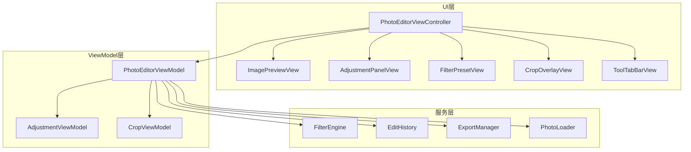

# 设计文档

## 概述

本项目是一个独立的 iOS 图片编辑应用，UI 模仿 Adobe Lightroom 风格。技术栈为 Swift + UIKit，图片处理基于 Apple Core Image 框架。应用采用 MVVM 架构，将 UI 层、业务逻辑层和图片处理层清晰分离。

核心设计决策：
- 使用 Core Image 的 CIFilter 链实现非破坏性编辑（所有调整参数叠加渲染，不修改原图）
- 预览使用降采样图片以保证实时性，导出时使用全分辨率
- 编辑历史基于参数快照而非图片快照，节省内存
- 滤镜预设本质上是一组预定义的调整参数组合

## 架构



整体采用 MVVM 架构：
- UI 层：纯视图，不包含业务逻辑
- ViewModel 层：持有状态，处理用户交互逻辑
- 服务层：图片处理、历史管理、导出等核心能力

## 组件与接口

### PhotoEditorViewController

主编辑页面控制器，协调所有子视图和 ViewModel。

```swift
class PhotoEditorViewController: UIViewController {
    private let viewModel: PhotoEditorViewModel
    private let previewView: ImagePreviewView
    private let adjustmentPanel: AdjustmentPanelView
    private let filterPresetView: FilterPresetView
    private let toolTabBar: ToolTabBarView
    
    func loadPhoto(asset: PHAsset)
    func exportPhoto()
    func undo()
    func redo()
}
```

### PhotoEditorViewModel

核心 ViewModel，管理编辑状态和协调各服务。

```swift
class PhotoEditorViewModel {
    // 状态
    var currentParameters: EditParameters { get }
    var canUndo: Bool { get }
    var canRedo: Bool { get }
    var activeFilter: FilterPreset? { get }
    
    // 操作
    func updateParameter(_ key: AdjustmentKey, value: Float)
    func applyFilter(_ preset: FilterPreset)
    func removeFilter()
    func applyCrop(_ rect: CGRect, rotation: Int)
    func undo()
    func redo()
    func exportPhoto(format: ExportFormat, quality: Int, completion: (Result<Void, Error>) -> Void)
    
    // 回调
    var onPreviewUpdated: ((CIImage) -> Void)?
    var onHistoryChanged: (() -> Void)?
}
```

### FilterEngine

基于 Core Image 的滤镜引擎，负责将编辑参数应用到图片。

```swift
class FilterEngine {
    private let context: CIContext
    
    /// 将编辑参数应用到原始图片，返回处理后的 CIImage
    func apply(parameters: EditParameters, to image: CIImage) -> CIImage
    
    /// 生成降采样预览图
    func generatePreview(parameters: EditParameters, source: CIImage, targetSize: CGSize) -> UIImage?
    
    /// 渲染全分辨率输出
    func renderFullResolution(parameters: EditParameters, source: CIImage) -> CGImage?
}
```

内部实现使用 CIFilter 链：
- 曝光 → `CIExposureAdjust`
- 对比度/饱和度/亮度 → `CIColorControls`
- 高光/阴影 → `CIHighlightShadowAdjust`
- 色温 → `CITemperatureAndTint`
- 锐度 → `CISharpenLuminance`
- 自然饱和度 → `CIVibrance`

### EditHistory

基于参数快照的编辑历史管理。

```swift
class EditHistory {
    private var undoStack: [EditParameters] = []
    private var redoStack: [EditParameters] = []
    
    var canUndo: Bool { get }
    var canRedo: Bool { get }
    
    func push(_ parameters: EditParameters)
    func undo() -> EditParameters?
    func redo() -> EditParameters?
}
```

### ExportManager

负责全分辨率渲染和保存到相册。

```swift
class ExportManager {
    func export(
        source: CIImage,
        parameters: EditParameters,
        format: ExportFormat,
        quality: Int,
        completion: @escaping (Result<Void, Error>) -> Void
    )
}

enum ExportFormat {
    case jpeg
    case png
}
```

### CropViewModel

管理裁剪状态。

```swift
class CropViewModel {
    var cropRect: CGRect { get set }
    var aspectRatio: AspectRatio { get set }
    var rotationCount: Int { get set } // 0-3，表示顺时针旋转 90° 的次数
    
    func rotate90Clockwise()
    func reset()
}

enum AspectRatio: CaseIterable {
    case free
    case square      // 1:1
    case fourThree   // 4:3
    case threeTwo    // 3:2
    case sixteenNine // 16:9
}
```

## 数据模型

### EditParameters

所有编辑参数的值对象，是整个系统的核心数据结构。

```swift
struct EditParameters: Codable, Equatable {
    var exposure: Float = 0      // -100 ~ +100
    var contrast: Float = 0      // -100 ~ +100
    var highlights: Float = 0    // -100 ~ +100
    var shadows: Float = 0       // -100 ~ +100
    var saturation: Float = 0    // -100 ~ +100
    var vibrance: Float = 0      // -100 ~ +100
    var warmth: Float = 0        // -100 ~ +100
    var sharpness: Float = 0     // -100 ~ +100
    
    var cropRect: CGRect?        // nil 表示未裁剪
    var rotationCount: Int = 0   // 0-3
    
    static let `default` = EditParameters()
    
    /// 所有调整参数是否都为默认值
    var isDefault: Bool {
        return self == EditParameters.default
    }
}
```

### FilterPreset

滤镜预设定义。

```swift
struct FilterPreset: Identifiable {
    let id: String
    let name: String
    let icon: String           // SF Symbol 名称
    let parameters: EditParameters
}
```

### AdjustmentKey

调整参数的枚举键。

```swift
enum AdjustmentKey: String, CaseIterable, Codable {
    case exposure
    case contrast
    case highlights
    case shadows
    case saturation
    case vibrance
    case warmth
    case sharpness
    
    var displayName: String { ... }
    var iconName: String { ... }    // SF Symbol
    var tabGroup: ToolTab { ... }
}

enum ToolTab: String, CaseIterable {
    case light    // 光效：曝光、对比度、高光、阴影
    case color    // 颜色：饱和度、自然饱和度、色温
    case effects  // 效果：（预留扩展）
    case detail   // 细节：锐度
}
```


## 正确性属性

*正确性属性是系统在所有有效执行中都应保持为真的特征或行为——本质上是关于系统应该做什么的形式化声明。属性是人类可读规范与机器可验证正确性保证之间的桥梁。*

### Property 1：参数调整产生有效输出

*For any* 有效的 EditParameters（所有值在 -100 到 +100 范围内）和任意有效的 CIImage，FilterEngine.apply 应返回一个非 nil 的 CIImage。

**Validates: Requirements 2.3**

### Property 2：参数范围与默认值不变量

*For any* AdjustmentKey，EditParameters 中对应参数的默认值 SHALL 为 0，且 Adjustment_Panel 允许的范围为 -100 到 +100。

**Validates: Requirements 2.4, 2.5**

### Property 3：滤镜应用同步参数

*For any* FilterPreset，应用该滤镜后，当前 EditParameters 的调整参数值 SHALL 等于该 FilterPreset 的 parameters 中对应的值。

**Validates: Requirements 3.2, 3.3**

### Property 4：滤镜应用-取消 round-trip

*For any* 初始 EditParameters 和任意 FilterPreset，先应用滤镜再取消滤镜，SHALL 恢复到初始的 EditParameters。

**Validates: Requirements 3.5**

### Property 5：宽高比约束正确性

*For any* 非自由的 AspectRatio 和任意初始裁剪框，约束后的裁剪框宽高比 SHALL 等于预设比例（在浮点精度误差范围内）。

**Validates: Requirements 4.3**

### Property 6：旋转 round-trip

*For any* CropViewModel 状态，连续执行 4 次 rotate90Clockwise 后，rotationCount SHALL 回到初始值。

**Validates: Requirements 4.4**

### Property 7：裁剪取消恢复状态

*For any* 进入裁剪模式前的 EditParameters，在裁剪模式中进行任意修改后取消，SHALL 恢复到进入前的 EditParameters。

**Validates: Requirements 4.6**

### Property 8：编辑历史增长不变量

*For any* EditHistory 和任意 EditParameters 序列，每次 push 后 canUndo SHALL 为 true，且 undo 栈长度增加 1。

**Validates: Requirements 5.1**

### Property 9：undo-redo round-trip

*For any* 非空的 EditHistory，执行 undo 然后 redo SHALL 返回 undo 之前的 EditParameters。

**Validates: Requirements 5.2, 5.3**

### Property 10：新操作清除 redo 历史

*For any* EditHistory 状态，执行 undo 后再 push 新的 EditParameters，canRedo SHALL 为 false。

**Validates: Requirements 5.6**

### Property 11：编辑参数序列化 round-trip

*For any* 有效的 EditParameters，序列化为 JSON 后再反序列化 SHALL 产生与原始值相等的 EditParameters。

**Validates: Requirements 8.1, 8.2, 8.3**

## 错误处理

| 场景 | 处理方式 |
|------|---------|
| 照片加载失败 | 显示错误弹窗，提供"重试"和"选择其他照片"按钮 |
| Core Image 滤镜链执行失败 | 回退到上一个有效的预览状态，静默记录错误日志 |
| 导出渲染失败 | 显示错误弹窗，包含失败原因描述 |
| 相册保存权限被拒绝 | 引导用户前往系统设置开启权限 |
| 内存警告 | 释放预览缓存，降低预览分辨率 |
| 无效的 JSON 反序列化 | 返回 nil 或抛出描述性错误，不崩溃 |

## 测试策略

### 属性测试（Property-Based Testing）

使用 [SwiftCheck](https://github.com/typelift/SwiftCheck) 作为属性测试框架，通过 CocoaPods 集成（pod 'SwiftCheck'）。

每个属性测试配置为至少运行 100 次迭代。每个测试用注释标注对应的设计文档属性编号。

标注格式：**Feature: photo-editor, Property {number}: {property_text}**

属性测试覆盖范围：
- EditParameters 的序列化 round-trip（Property 11）
- EditHistory 的 undo/redo 行为（Property 8, 9, 10）
- CropViewModel 的旋转 round-trip（Property 6）
- 宽高比约束计算（Property 5）
- 滤镜应用/取消 round-trip（Property 3, 4）
- 参数默认值和范围不变量（Property 2）

### 单元测试

使用 XCTest 框架，覆盖：
- FilterEngine 对各个 CIFilter 参数映射的正确性
- 具体的滤镜预设应用示例
- 导出格式和质量参数验证
- 边界条件：空历史的 undo/redo、参数边界值
- 错误场景：无效 JSON 反序列化、导出失败处理

### 测试互补性

- 单元测试：验证具体示例、边界条件和错误场景
- 属性测试：验证跨所有输入的通用属性
- 两者互补，共同提供全面的覆盖
