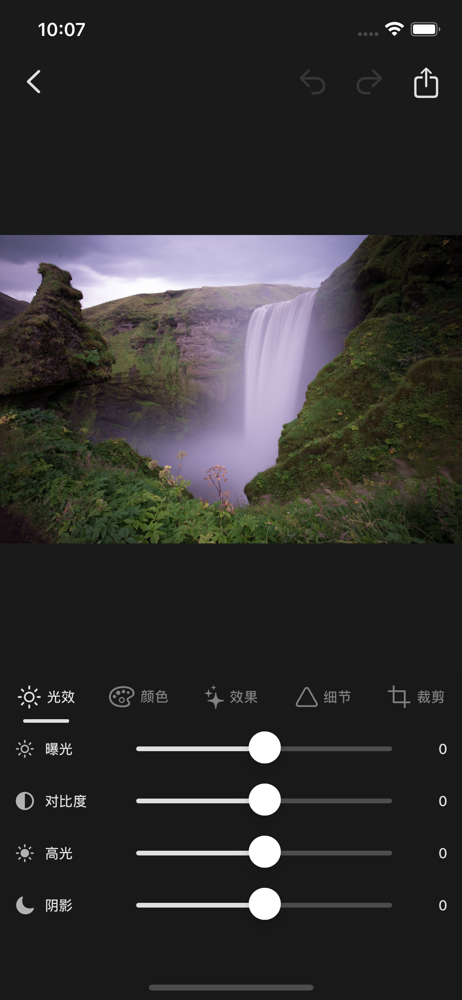

# PhotoEditor

一款 Lightroom 风格的 iOS 图片编辑应用，使用 Kiro 驱动开发。从需求定义、架构设计到代码实现，整个开发流程由 Kiro 的 Spec 驱动开发工作流完成。

## 功能

- 基础参数调整：曝光、对比度、高光、阴影、饱和度、自然饱和度、色温、锐度
- 10+ 内置滤镜预设（鲜艳、暖色、冷色、黑白、复古等）
- 裁剪与旋转（支持自由、1:1、4:3、3:2、16:9 比例）
- 撤销 / 重做
- JPEG / PNG 导出，可选质量参数
- 深色主题 UI，模仿 Adobe Lightroom

## 截图

<p align="center">
  
</p>

## 技术栈

- Swift + UIKit
- Core Image（CIFilter 链式非破坏性编辑）
- MVVM 架构
- SnapKit（Auto Layout）
- SwiftCheck（属性测试）
- CocoaPods 依赖管理

## 由 Kiro 驱动

本项目使用 Kiro 的 Spec 驱动开发流程构建：

1. **需求阶段** — 根据功能想法生成结构化需求文档（EARS 模式 + INCOSE 质量规则）
2. **设计阶段** — 产出架构设计、组件接口、数据模型和正确性属性
3. **实现阶段** — 按任务清单逐步实现代码，每步都有对应的属性测试验证

完整的 Spec 文档位于 `.kiro/specs/photo-editor/` 目录下。

## 项目结构

```
PhotoEditor/
├── Models/          数据模型（EditParameters, FilterPreset, AdjustmentKey 等）
├── ViewModels/      视图模型（PhotoEditorViewModel, CropViewModel）
├── Views/           UI 视图（编辑器主界面、调整面板、滤镜列表、裁剪覆盖层）
├── Services/        核心服务（FilterEngine, EditHistory, ExportManager, PhotoLoader）
└── Assets.xcassets/ 资源文件
```

## 许可证

MIT
